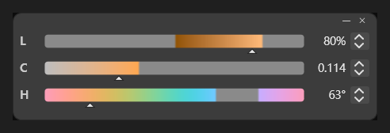

# CspPaletteLCH

为 CLIP STUDIO PAINT 外挂一个 OKLCH 滑条面板。

## 为什么用 OKLCH？

CSP 自带的滑块是 CMYK / HSV / HSL 那几套。OKLCH 里 **L 是感知明度**、C 是彩度、H 是色相，
好处是调亮度不会把颜色冲淡（HSV 的 S 会），想找"同一个亮度的另一个颜色"也很直观 ——
只动 H 就行，不用来回补 S

## ✨ 功能特性

- 使用 OKLCH 色彩空间调色，L 是感知明度，调亮不容易把颜色冲淡，换色相也更直观。
- 启动快、体积小，双击 exe 直接运行；
- 三条滑条 L / C / H，外观照 CSP 的「颜色滑块」。
- 点面板不抢 CSP 前台，选完色可直接回画布开画。
- CSP 最小化，面板也自动最小化；CSP 切回来，面板也回来。
- 可像 CSP 窗口一样折叠：双击标题栏或点 `—`。
- 点 `✕` 收起到托盘，不退出程序；退出走托盘右键菜单。
- 双击滑条锁定通道；锁定一条后拖另外两条，颜色会被夹在 sRGB 色域内，拖到边界停住。
- 渐变条上超出 sRGB 的区段显示为灰色，一眼看出不可显示区域。
- 记住窗口位置和上次颜色槽。
- 目前只在 Clip Studio Paint 5.0.4 测试过，其他版本未验证。
## 用法

1. 在 CSP 里打开「连接手机」窗口（它会显示一个二维码）。
2. 启动 `CspPaletteLCH.exe`：它会自动截屏找到二维码完成配对（最多自动扫 10 次）。
   配对信息存在 `%APPDATA%\CspPaletteLCH\session.json`，之后直接重连，不用再扫码。
3. 拖滑条 → 颜色实时写给 CSP 当前的颜色槽；反过来在 CSP 里改颜色（比如用吸管），面板也跟着变。
4. 退出：托盘图标右键 → 退出。

- 修改CspLch.bat文件可以让本软件和CSP一起启动。
说明与限制
- 本项目是 **CspPalette** 的变体：CspPalette 是"色轮 + 七种色彩空间 + 历史色格"的完整版，
  这里是"只留三条 OKLCH 滑条 + 完全照 CSP 的样式"的清爽版，两者互不影响。
